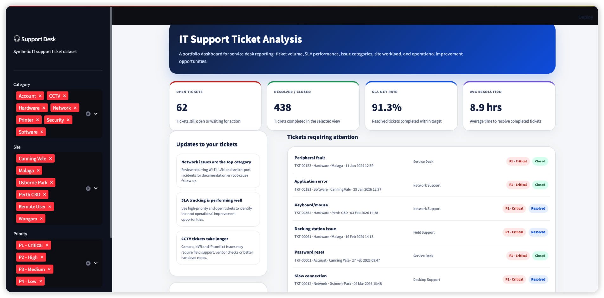
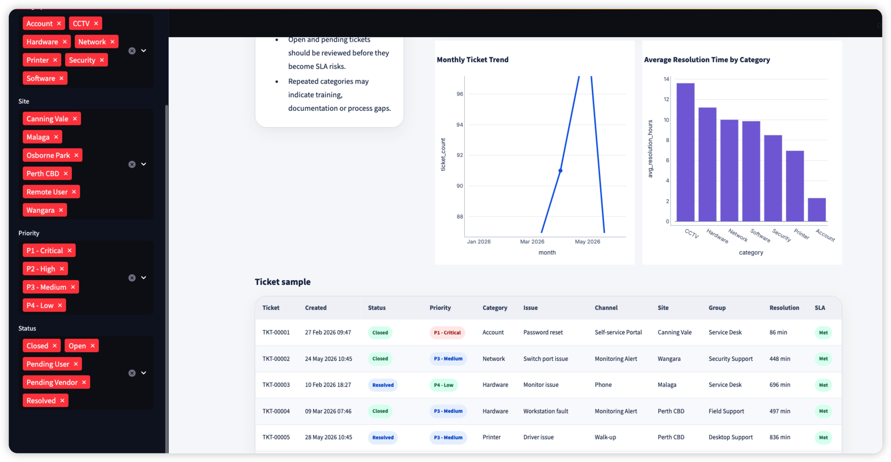

# IT Support Ticket Analysis Dashboard

A portfolio project that uses synthetic IT support ticket data to analyse service desk workload, issue categories, SLA performance, resolution time, support channels, and operational improvement opportunities.

This project connects practical IT support knowledge with Python-based data analysis and dashboard reporting.



---

## Project Overview

In IT support and service desk environments, ticket data is one of the most useful sources for understanding operational workload and service quality.

This project simulates a help desk ticket dataset and builds a dashboard to answer questions such as:

- What types of IT issues occur most often?
- Which ticket categories take the longest to resolve?
- Are tickets being resolved within SLA targets?
- Which sites or support channels generate the most workload?
- Which areas may need better documentation, training, or process improvement?

The dashboard is built with Python, pandas, Plotly, and Streamlit.

---

## Why This Project Matters

For IT Support, Desktop Support, Field Support, and Junior Network Support roles, technical troubleshooting is only one part of the job.

Support teams also need to:

- Understand recurring issues
- Prioritise urgent tickets
- Monitor SLA performance
- Communicate workload clearly
- Identify process and documentation gaps
- Use data to improve support quality

This project demonstrates how ticket data can be turned into useful operational insights.

---

## Dashboard Preview

### Service Desk Overview



The dashboard includes:

- Open ticket count
- Resolved / closed ticket count
- SLA met rate
- Average resolution time
- Tickets requiring attention
- Operational insights
- Ticket volume by category
- Ticket volume by priority
- Monthly ticket trend
- Average resolution time by category
- Ticket sample table

---

## Dataset

The dataset is fully synthetic and does not contain any real company, customer, employee, or ticket information.

Generated fields include:

- `ticket_id`
- `created_at`
- `resolved_at`
- `status`
- `priority`
- `category`
- `subcategory`
- `channel`
- `site`
- `assigned_group`
- `resolution_minutes`
- `sla_target_minutes`
- `sla_met`
- `root_cause`
- `customer_satisfaction`

Example ticket categories include:

- Network
- Hardware
- Software
- Account
- Printer
- CCTV
- Security

These categories are designed to reflect common IT support and field support scenarios.

---

## Key Features

### Synthetic Ticket Generator

`src/generate_tickets.py` creates realistic but synthetic help desk ticket records.

It simulates:

- Different issue categories
- Priority levels
- SLA targets
- Resolution times
- Open, pending, resolved, and closed tickets
- Site and channel distribution
- Customer satisfaction scores

### Analysis Script

`src/analysis.py` produces summary tables for:

- Ticket volume by category
- SLA performance by priority
- Average resolution time by category
- Site workload
- Channel workload
- Monthly ticket trend

### Streamlit Dashboard

`app.py` provides an interactive dashboard with sidebar filters for:

- Category
- Site
- Priority
- Status

The dashboard is designed to look like a modern service desk reporting interface.

---

## Tech Stack

- Python
- pandas
- numpy
- Plotly
- Streamlit
- Git

---

## Project Structure

```text
it-support-ticket-analysis/
├── app.py
├── assets/
│   ├── dashboard-overview.png
│   └── dashboard-ticket-table.png
├── data/
│   └── synthetic_it_tickets.csv
├── output/
├── src/
│   ├── generate_tickets.py
│   └── analysis.py
├── requirements.txt
├── .gitignore
└── README.md
```

---

## How to Run Locally

### 1. Clone the repository

```bash
git clone https://github.com/MichaelSai103/it-support-ticket-analysis.git
cd it-support-ticket-analysis
```

### 2. Create a virtual environment

```bash
python -m venv .venv
source .venv/bin/activate
```

On Windows:

```bash
.venv\Scripts\activate
```

### 3. Install dependencies

```bash
pip install -r requirements.txt
```

### 4. Generate synthetic ticket data

```bash
python src/generate_tickets.py
```

Optional: generate more records.

```bash
python src/generate_tickets.py --tickets 1000
```

### 5. Run the analysis script

```bash
python src/analysis.py
```

### 6. Launch the dashboard

```bash
streamlit run app.py
```

---

## Example Insights

From the synthetic dataset, the dashboard can highlight insights such as:

- Network-related tickets are often the highest-volume category.
- CCTV and hardware issues may take longer to resolve because they often require onsite checks or vendor involvement.
- Open and pending tickets should be reviewed before they become SLA risks.
- Repeated ticket categories may indicate a need for better user guidance, technical documentation, or process improvement.
- Ticket data can help support teams communicate workload and service quality more clearly.

---

## Portfolio Relevance

This project demonstrates my ability to combine:

- IT support process understanding
- Troubleshooting category analysis
- SLA and service performance reporting
- Python data analysis
- Dashboard design
- Clear technical documentation

It is especially relevant to roles such as:

- IT Support Technician
- Desktop Support Technician
- Field IT Support
- Junior Network Support
- Technical Support Officer
- Junior Data Analyst
- Data Support Analyst

---

## Future Improvements

Planned improvements include:

- Add a Power BI version of the dashboard
- Add root cause trend analysis
- Add SLA breach prediction logic
- Add ticket ageing analysis
- Add automated weekly reporting
- Deploy the Streamlit dashboard online
